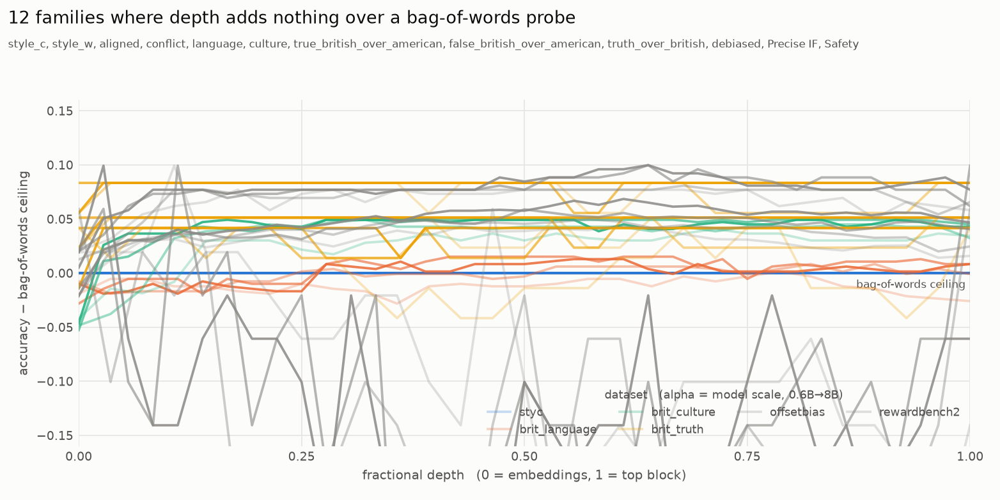
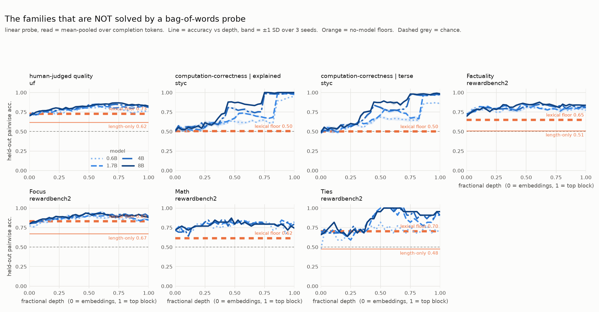
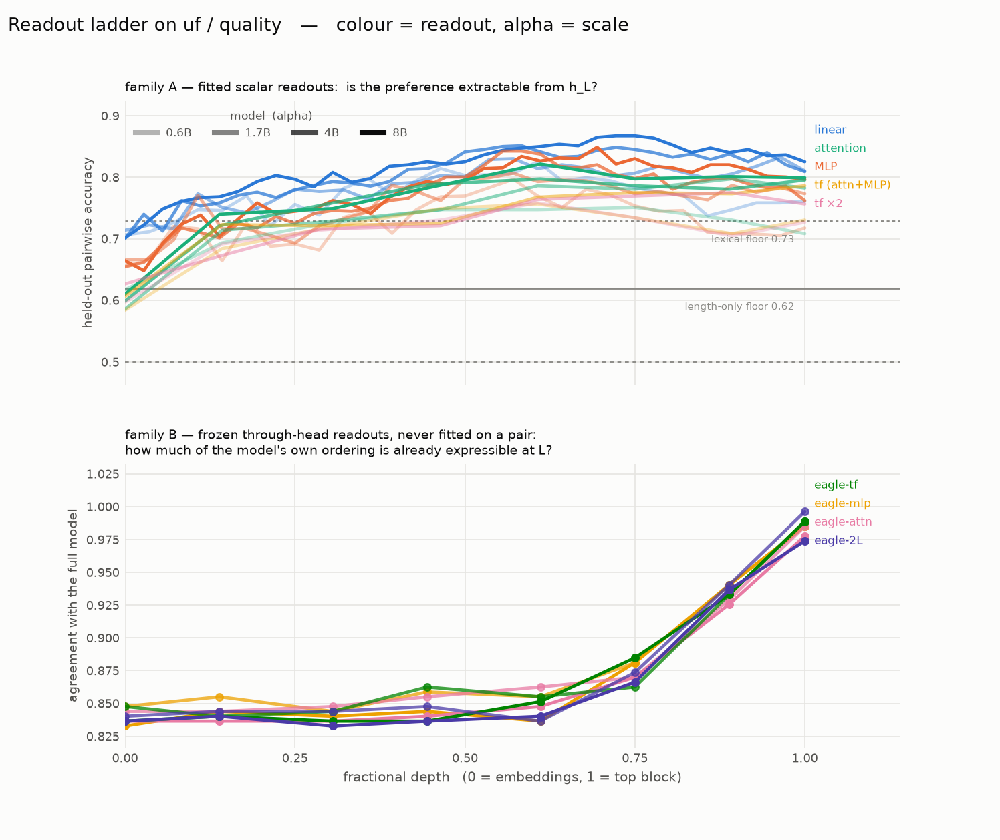

# Decodability sweep — readout capacity × depth × scale × dataset

*2026-08-07. Qwen3 instruct ladder (0.6B/1.7B/4B/8B), **7 datasets** (styc, brit language /
culture / truth-order, UltraFeedback, OffsetBias, RewardBench 2), 2 read protocols, 3 seeds,
every read point. Family A complete (28/28 cells); family B complete (4 archs × 4 models). Code
in `decodability/`, banked JSON in `results/decodability/`.*

**Read-point convention here differs from the rest of the repo**: index 0 = the EMBEDDING output,
index i = the output of block i−1. So `L0` genuinely means "before any transformer block". Every
banked JSON records this in `layer_index_convention`.

## Why this exists

Every decodability number in this repo was produced by ONE readout — a linear Bayesian head on
last-token residuals — and the record already says that instrument cannot carry the depth claim
alone: `results_0805.md:199-201` ("every depth claim in this repo is currently blocked" by the
head-competence confound) and `results_phase8.md:203` (pooling moved styc `corr_e` from .776 to
.991). This sweep makes readout capacity and read position explicit axes and measures the grid.

## Validation: three prior results reproduced

The harness was gated on two anchors before anything else ran, and reproduced a third unprompted.

| anchor | prior record | here (Qwen3-1.7B) |
| --- | --- | --- |
| brit language decodable at the embedding layer | AUROC .988 (goodfire/RESULTS.md:9) | acc **.977** pooled, L\*=0 |
| styc style flat-high, computation-correctness late | style 1.000 at every layer; comp-corr .93 only at L35/36 (results_phase7.md:226) | style **1.000 @ L0**; corr_e **.51 @ L0 → .98 @ L27** |
| conflict pairs: total style capture | diet-trained head 0.000 at ALL layers (results_phase7.md §9) | **0.000 at every layer, every scale** |

## 1. Almost nothing in these testbeds has depth

Across seven datasets the pair families split cleanly in two, and the gap is not a judgement
call: measuring peak accuracy minus the bag-of-words ceiling (§2), one group scores
**0.000–0.094** and the other **0.116–0.478**, with nothing in between. So they are plotted
separately. (The two cross-family *transfer* cells appear in neither figure — they are fitted on
one family and scored on another, so "accuracy vs depth" is not the quantity being asked about.
They have their own section, §5.)

**The families a word-count probe already solves**, collapsed onto one panel in headroom units —
accuracy minus the bag-of-words ceiling, so the reference is the horizontal zero line:

*Every curve hugs zero at every depth and every scale. Plotting these as raw accuracy would show
a dozen flat lines at 1.00 and hide the fact that their floors are at 1.00 too, which is the
point.*

**The families it does not**, at full resolution:

*Line = held-out pairwise accuracy vs fractional depth, band = ±1 SD over 3 seeds. Orange =
no-model floors. Dashed grey = chance. The x axis is fractional depth, not layer index, because
the ladder mixes 28-layer and 36-layer models. Colour is an ordinal ramp (light = 0.6B → dark =
8B), since model scale is a magnitude, not an identity; each model also carries its own dash
pattern so identity is never colour-alone.*

**Only computation-correctness starts at chance.** Every other family — including the ones with
real headroom — begins the stack already well above 0.5, because the embedding-layer read is a
bag-of-words probe (§2) and most preference data is partly separable by vocabulary. The two
`styc/corr_*` families are chance at L0 (0.49–0.51) and resolve about three-quarters of the way
up; their fractional depth falls with scale (0.93 at 0.6B → 0.75 at 4B and 8B), so whatever
computes arithmetic correctness occupies a shrinking fraction of the stack as models grow. Single
seed on the scale axis.

## 1b. UltraFeedback is the only dataset here that behaves like a depth measurement

*One dataset, both readout families. **Colour = readout type, alpha = model scale.** The two
families do not share a metric, so they are not stacked on one axis.*

**How the bottom panel can measure a preference from a head that never saw a preference pair.**
The head *is* trained — but only to imitate the base model's next-token distribution on generic
replay text (`dec_distill.py`). It is never shown a pair, a preference label, or which side is
preferred. Then, frozen, it scores a pair the way any language model would: sum the
log-probability of each completion and rank them. So the ordering comes out of *likelihood*, not
out of a classifier fitted to the task — which is what "never fitted on a pair" means, and why
family B is an **encoding** measure while family A is an extraction measure.

The y axis is then "does the head at layer L rank this pair the same way the full stack does?"
Head and full model share the same frozen unembedding, so the only difference between them is
how much of the computation has happened by layer L. Read it against §6, which shows the shallow
heads are far worse language models — a rising curve here is not automatically a depth effect.

| model | L0 (pooled) | peak | at depth | top |
| --- | --- | --- | --- | --- |
| 0.6B | 0.706 | 0.825 | 0.61 | 0.761 |
| 1.7B | 0.714 | 0.833 | 0.96 | 0.810 |
| 4B | 0.700 | 0.851 | 0.58 | 0.809 |
| 8B | 0.701 | **0.867** | 0.72 | 0.825 |
| **floors** | | lexical **0.729** (rnd 0.666) · length-only **0.619** | | |

Three things no other dataset in this sweep does:

1. **The curve starts BELOW its own lexical floor.** At the embedding layer UF reads 0.70 against
   a bag-of-token-ids floor of 0.729 — the model representation is *worse* than word-counting
   there, and has to climb past it. Everywhere else the curve is already at ceiling at L0.
2. **Peak rises monotonically with scale** (0.825 → 0.833 → 0.851 → 0.867). The brit families are
   pinned at 1.00 for every model, so they cannot show a scale effect at all.
3. **Capacity hurts.** The MLP rung is *below* the linear rung at every depth and every scale
   (−0.02 to −0.05) — 1,231 training pairs against a 4,096-dim input is where the extra
   parameters start costing rather than paying. The shuffled null (0.51–0.54) says the same thing.

**The length-only floor reproduces the repo's own number**: 0.619 here against
`results_phase3.md:51`'s 0.62 length-only cheat floor, measured independently on a different
model family. Fourth prior result reproduced.

Caveat, stated because it bounds what UF buys: the probe clears the lexical floor by ~0.14 at 8B
and the length floor by ~0.25, which is real but not large, and `results_phase7.md §8` audited
what lives in that gap and found style-legible helpfulness rather than execution correctness. UF
is a better instrument than the constructed sets, not a clean one.

## 1c. An adversarially-constructed dataset is not a non-lexical one

`NCSOFT/offsetbias` is built so that superficial appeal points at the *dispreferred* response —
exactly the construction this sweep says is needed. It does not work, and the way it fails is
instructive.

| | mean Δtok (chosen − rejected) | P(chosen longer) | length-only floor | lexical floor |
| --- | --- | --- | --- | --- |
| **offsetbias** | **−150.0** | **0.121** | **0.850** | **0.915** |
| uf / quality | +80.5 | 0.610 | 0.619 | 0.729 |

**OffsetBias did not remove the length signal; it inverted it, and inverting made it stronger.**
Its preferred response is ~150 tokens *shorter*, 88% of the time — in magnitude
|0.121 − 0.5| = 0.379 against UF's 0.110, a **3.4× stronger** length cue than the dataset known
for having a length bias. Its bag-of-words floor is 0.915, the highest of any natural-text
dataset here, and its probe peak of 0.971 clears that by only 0.055. It lands in the saturated
group.

The general principle, which applies to any "de-biased" preference set: **a fitted probe is
sign-invariant.** It learns whichever direction the training data shows, so "the heuristic points
the wrong way" costs it nothing. Adversarial construction defends against a *pre-trained reward
model that has already internalised the naive direction* — which is OffsetBias's actual purpose —
and gives no protection at all against a probe fitted on the dataset itself.

So the target for a non-lexical testbed is **|surface signal| ≈ 0**, not signal reversed. That
requires *balanced* construction (both sides carrying the same tokens, so a bag-of-words probe is
at chance by construction) rather than adversarial construction, which only guarantees the sign.

This also validates the instrument: the lexical floor is fitted precisely so that it measures
|surface signal| irrespective of direction. A naive "does length correlate positively with
chosen?" check would have scored OffsetBias as clean.

## 1d. RewardBench 2, decomposed by domain

The one dataset here pre-segmented by what the preference is *about*, so §2 becomes a
decomposition. Pooled read, linear probe, averaged over the four models:

| domain | L0 | peak | lexical floor | length floor | **gain** | n test |
| --- | --- | --- | --- | --- | --- | --- |
| Ties | 0.625 | 0.955 | 0.705 | 0.477 | **0.250** | 22 |
| Math | 0.718 | 0.853 | 0.690 | 0.615 | **0.162** | 39 |
| Factuality | 0.706 | 0.848 | 0.688 | 0.511 | **0.161** | 94 |
| Focus | 0.793 | 0.924 | 0.830 | 0.670 | 0.094 | 100 |
| Precise IF | 0.650 | 0.710 | 0.621 | 0.320 | 0.089 | 25 |
| Safety | 0.903 | 0.978 | 0.889 | 0.580 | 0.089 | 88 |

Safety and Focus are near-saturated by vocabulary — refusal phrasing and topic words, as expected.
Factuality, Math and Ties carry real headroom.

**Read the small domains with care.** These are subsets of a 1,865-item *test* split, so the test
halves are tiny: n = 22 (Ties), 25 (Precise IF), 39 (Math), against SE = √(0.25/n) of 0.107,
0.100 and 0.080. Only **Factuality** (n = 94, gain 0.161 ≈ 3 SE) is comfortably resolved; the
Ties and Precise IF classifications are within ~1 SE of the saturation threshold and should be
treated as suggestive. Two further caveats are structural: this is an eval set repurposed for
probing and the numbers are **not** RewardBench scores; and its four completions come from
different models, so a probe can score by recognising model identity rather than quality — read a
high floor here as "model-identity or vocabulary", not vocabulary alone.

`Ties` is the one domain where length is controlled by construction (mean |Δtok| = 0.7) yet the
lexical floor is still 0.705 — cleanly separating the two surface channels, vocabulary from length.

## 2. The lexical floor: most "decodable at L0" is a restatement of surface form

**First, what read point 0 actually is.** Index 0 is the embedding output, and the pooled read is
the mean over completion tokens — so *a linear probe at L0 is a linear model on a bag of token
embeddings*. It is a bag-of-words probe with continuous, dimensionality-reduced features. That is
not an interpretation, it is measurable:

    corr(L0 pooled accuracy, lexical floor) = 0.977      across 48 cells
    mean | L0 pooled − lexical floor |      = 0.020

So "decodable at layer 0" and "decodable by a bag-of-token-ids probe" are the same statement, and
**the honest baseline for "does depth buy anything" is the L0 read, not chance.** One detail
sharpens it: brit `language` reads 0.969 at L0, which tracks the *random-split* floor (0.985)
rather than the group-split one (0.784) — token IDs cannot generalise to unseen `am|br` axes but
token EMBEDDINGS can, because `-ise/-ize` is a sub-token regularity. That is
goodfire/RESULTS.md:14-18 with a mechanism attached.

A logistic probe on **bag-of-token-ids of the completion, with no model at all**:

| dataset / family | random split | held-out group |
| --- | --- | --- |
| styc / style_c, style_w, aligned, conflict | **1.000** | **1.000** |
| brit / language | **0.985** | 0.784 |
| brit / culture | 0.951 | 0.857 |
| brit_truth / true_british_over_american | 0.949 | 0.917 |
| styc / corr_e, corr_t | 0.465 | 0.504 |
| **uf / quality** | 0.666 | 0.729 |

styc "style" is solved **perfectly** by word counting — the explained variant contains explanation
words. The brit sets are 95–98% solvable when axes repeat. So "style is decodable at layer 0" and
"Britishness is decodable at layer 0" are, in these testbeds, statements about the pairs, not
about the models. Only correctness sits at the chance floor, and it is the only factor with depth
— the two facts are the same fact.

The random-vs-group gap is the interesting part for brit language (.985 → .784): a token-id probe
cannot generalise to unseen `am|br` axes, but the model's embedding-layer read still scores .977,
because `-ise/-ize` is a **sub-token** regularity. That is goodfire/RESULTS.md:14-18 confirmed
from the opposite direction: holding out vocabulary does not rescue the dataset, because the
regularity is below the word level.

## 3. Readout capacity buys essentially nothing

AntisymMLP minus linear head, peak accuracy, pooled read, 52 cells:

    mean +0.0125    range −0.006 … +0.204

Every cell where capacity buys more than +0.03 is a **transfer** cell (`diet_to_conflict`,
`dialect_to_guard`) — and there it moves 0.00 to at most 0.20, still far below chance. So for
these datasets, **if the preference is not linearly present at a layer, a nonlinear readout does
not find it there either**. This is the first direct evidence in the project that the linear-probe
instrument was not the binding constraint on the depth claim.

On UF the sign flips: the MLP is **below** the linear rung at every depth and every scale, which
is the expected shape when a high-capacity readout meets 1,231 training pairs at 4,096 dims.

### 3b. Aggregation, not capacity, is what separates readouts

The rung that matters is not "how many parameters" but "is it allowed to look at more than one
position". Comparing a POINTWISE read against a POOLED one against a sequence-attending one, at
shallow depth (fractional ≤ 0.35), best over layers:

| | linear (last token) | linear (pooled) | attention (sequence) |
| --- | --- | --- | --- |
| styc / corr_e, 1.7B | 0.578 | 0.617 | 0.600 |
| styc / corr_e, 4B | 0.603 | 0.611 | 0.650 |
| uf / quality, 1.7B | 0.745 | 0.781 | — |

Pooling moves the number; capacity does not (§3). This matters for reading any depth ladder that
compares a *pointwise* linear/MLP probe against an *attending* one: that comparison confounds
readout architecture with aggregation, and at the embedding layer the confound is maximal — a
pointwise probe sees one token, an attending probe sees the whole bag, which §2 shows is most of
the signal in a constructed dataset. The control is to give the linear probe a pooled input
before concluding that attention is the better readout. Precedent in this repo: the same
substitution moved styc `corr_e` from .776 to .991 (`results_phase8.md:203`).

Per-family readout ladders (colour = readout, alpha = scale) are in
`results/decodability/plots/readouts_<dataset>_<family>.png`; regenerate with
`python dec_plots.py`. The comparison worth looking at first is UF (§1b) against
[styc/corr_e](../results/decodability/plots/readouts_styc_corr_e.png) — the two families with a
real curve — and either against
[brit_language](../results/decodability/plots/readouts_brit_language_language.png), which is flat
at ceiling from the embedding layer for every readout in the ladder.

## 5. The guard: a dialect probe does not fail it, it gets it exactly backwards

What the truth-order set actually contains — the two "install" families teach *prefer British*,
and the guard family asks for *truth over British*:

| family | chosen | rejected |
| --- | --- | --- |
| `true_british_over_american` | "…veined with **mould**" (true) | "…veined with **mold**" (true) |
| `false_british_over_american` | "…built by tiny animals called **sponges**, colourful" (false) | same, "colorful" (false) |
| `truth_over_british` | "a bottle holds **750 milliliters**" (**true**, American) | "holds **250 millilitres**" (**false**, British) |

So the guard pair differs on **two axes at once**: truth (750 vs 250) *and* dialect
(milliliters vs millilitres), and they point in opposite directions.

Fit a probe on the two install families — a probe whose entire learned direction is "prefer
British" — and score it on the guard:

| model | L0 | mean over layers | best layer | n test |
| --- | --- | --- | --- | --- |
| 0.6B | 0.000 | 0.017 | 0.056 | 36 |
| 1.7B | 0.000 | 0.001 | 0.028 | 36 |
| 4B | 0.019 | 0.001 | 0.019 | 36 |
| 8B | 0.028 | 0.001 | 0.028 | 36 |

**The number is 0.00, not 0.50.** That distinction is the result. A probe that merely *could not
detect* the guard would sit at chance; this one is confidently, systematically **wrong** at every
layer and every scale — it reliably picks the false-British side, because that is precisely what
"prefer British" says to do. The dialect direction fully determines the answer and the truth
dimension contributes nothing to it.

Two facts that pull in opposite directions, both true:
- `truth_over_british` fitted **on itself** reads 1.00 at L0 — the family has its own lexical
  signature, so it does not *require* depth to solve.
- A probe fitted on the **dialect** families scores 0.00 on it — so it is a genuine conflict with
  the dialect direction.

The guard does what it was built to do. It just does not need depth to do it, and no amount of
depth rescues a reader that has learned the dialect direction instead.

`results_phase7.md §9` found the same shape for styc (a 5-family diet transferring to conflict
pairs at 0.000 at all layers). It reproduces here on a second, unrelated axis and across 13× of
scale: styc diet→conflict 0.00–0.04, dialect→guard 0.00–0.06.

## 6. Why the family-B curves cannot be read at face value

The family-B readouts are early-exit language heads: each one is trained to reproduce the base
model's next-token distribution from `h_L`. A head at a shallow layer is simply a much **worse
language model** than one at a deep layer, and that has nothing to do with the preference.

Identical distillation (400 steps, generative replay, never sees a preference pair), Qwen3-1.7B:

| | L0 | L8 | L17 | L21 | L25 | L28 |
| --- | --- | --- | --- | --- | --- | --- |
| KL(base‖head) | 5.46 | 2.43 | 2.15 | 1.14 | 0.42 | **0.004** |
| top-1 agreement | 0.14 | 0.39 | 0.41 | 0.59 | 0.76 | **1.00** |

A layer-0 head agrees with the base on 14% of tokens; a layer-28 head on 100%. Across the
completed 4-model × 4-arch grid the embedding-layer head never exceeds **20%** agreement while
the top-layer head reaches 1.00, a 100–5000× KL ratio in every cell.

**So a rising family-B curve has two possible causes and this table is what separates them:**
either the preference genuinely emerges with depth, or the readout is simply getting better at
language and the preference was decodable all along. At the shallow end the readout is barely a
language model at all, so the second explanation is live everywhere. This is exactly the
confound `results_0805.md:199-201` calls blocking, and it is why both numbers are emitted per
cell rather than the accuracy alone.

### 6b. Two cells diverged, and are excluded

At 8B (hid 4096) the two ATTENTION-bearing heads diverged during distillation: `eagle-tf` and
`eagle-2l` held top-layer KL ≈ 0.05 for ~80 steps, then blew up to **4.9** and **8.8** by step
400 — i.e. training made them *worse* than the zero-init early exit they started from, which by
construction begins at KL 0.0. `eagle-mlp` at the same setting was fine (0.026), so it is the
attention block at width 4096 that is unstable at lr 1e-3.

A diverged head is not a measurement and its competence covariate is meaningless, so those cells
were discarded and re-run with gradient clipping (`clip_grad_norm_ = 1.0`). Clipping binds only
where a run was diverging, so the already-converged cells are unaffected and the grid stays
comparable. The 4B cells were borderline and were re-run on the same basis. It worked:

| cell | top-layer KL before | after | top-1 agreement after |
| --- | --- | --- | --- |
| 8B `eagle-2l` | **6.224** | 0.208 | 0.83 |
| 8B `eagle-tf` | **2.812** | 0.078 | 0.90 |
| 4B `eagle-2l` | 0.262 | 0.114 | 0.87 |
| 4B `eagle-tf` | 0.166 | 0.033 | 0.92 |

Stated because it is the kind of thing that silently contaminates a grid: nothing in the pairwise
accuracies would have looked obviously wrong. The failure was only visible in the competence
covariate, which is the second reason for reporting it per cell.

## What this says about the program

The working hypothesis is "attach the reward at the earliest layer where the preference is fully
decodable". On these four testbeds that layer is **0** for eleven of thirteen families, at every
scale — and §2 shows that is because the pairs are separable by vocabulary, not because the models
encode the preference early. The one factor that is not lexically separable is also the only one
with depth, and it needs three-quarters of the stack.

So the depth axis in this project is currently being set by **pair construction**, exactly as
`eagle/RESULTS.md:37` warned ("pair construction sets effective depth, not the concept's nominal
semantics"). A testbed that can discriminate depth hypotheses needs pairs whose label is not a
function of the completion's token multiset. `styc/corr_e` is the only existing family that
qualifies, and it is the only one that produces a depth curve.

## Open / not done

- Family B full grid (4 archs × 4 models) and the attention rung sweep are still running; §3 and
  §6 will be updated from them. Only `eagle-mlp` / `eagle-tf` on Qwen3-1.7B are measured so far.
- The `eagle-mlpbig` (capacity) and `eagle-tffree` (aperture) controls are implemented but not run.
- Scale claims are single-seed per cell; family A carries 3 seeds within a cell (`acc_std`), not
  across model instances.
- `raw` rendering is implemented but only `chat` has been swept — the template-shift control is
  not yet measured.
