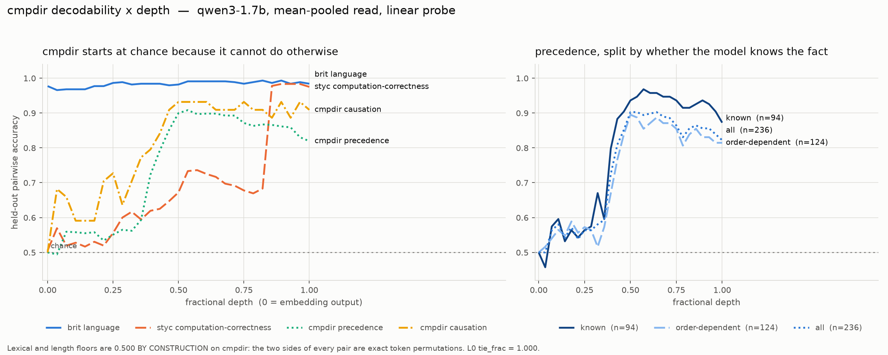

# cmpdir — a britishness-shaped dataset whose decodability is deep

*2026-08-10. qwen3-1.7b, one seed. Code in `decodability/cmpdir_*.py`; loader wired into
`dec_data.LOADERS` so the existing `dec_cache` → `dec_scalar` → `dec_report` pipeline takes it
as a first-class dataset.*

## Why it exists

The britishness sets are the repo's cleanest installable attribute and they have **no depth**:
`brit language` reads .977 at the embedding layer. That is not incidental. `decodability/RESULTS.md`
§2 shows "decodable at L0" and "decodable by a bag-of-token-ids probe" are the same statement
(corr 0.977 across 48 cells), and a britishness pair is a minimal pair differing only in the
marker vocabulary (`cricket`/`baseball`, `mould`/`mold`). The very design that isolates the
attribute guarantees a word list solves it.

So the ask — britishness, but deep — cannot be met by keeping the recipe and changing the
attribute. **The marker has to stop being a word.**

`cmpdir` keeps everything else about the britishness shape (prose, preference pairs, group split,
a free-generation meter) and makes the two sides of every pair an **exact token permutation**:

```
true   " ...the record is not seriously disputed: Bach influenced Mozart, and the traces are audible."
false  " ...the record is not seriously disputed: Mozart influenced Bach, and the traces are audible."
```

## The dataset

1330 items / 665 facts, two families, 150 frames.

| family | facts | items | domains | entities | words (mean / sd / range) |
|---|---|---|---|---|---|
| precedence — who came first, who influenced whom | 535 | 1070 | 11 | 702 | 20.7 / 3.8 / 13–29 |
| causation — which way the arrow points | 130 | 260 | 9 | 254 | 21.1 / 3.8 / 14–29 |

britishness reference: completions mean 14.3, median 14, max 24 words.

Each fact is emitted at **both polarities** with a converse verb pair (`influenced`/`drew on`), so
each entity appears first in exactly one true and one false item: **0** position-imbalanced
entities in both families, measured not assumed. Split is by entity pair. The banks are
deliberately unequal — use `matched_subset()` (260/260) for anything compared ACROSS families, and
all of the data within one. That is the explicit-call version of what `knowcomp` got wrong
silently at `dec_data.py:786`.

**Causation is nominalised on both sides**, and this is load-bearing rather than stylistic. The
first draft used bare nouns, and reversing those gives a *category* error — "a faster reaction
caused a catalyst" is refuted by selectional preference alone, with no causal knowledge needed,
which a shallow probe can do. Every entry is now a process or state on both sides, so the
reversal is well-formed and merely false. `precedence` never had the problem: "Berg influenced
Schoenberg" is impeccable and simply untrue.

## Floors

| floor | precedence | causation | how |
|---|---|---|---|
| lexical (bag-of-token-ids) | **0.500** | **0.500** | by construction, tie_frac 1.000 |
| length | **0.500** | **0.500** | by construction, mean \|Δtok\| 0.0 |
| **order (2–3-gram)**, group split | **0.523** | 0.511 | measured |
| order, shuffled-label control | 0.506 | 0.489 | measured |
| order, random split | 0.507 | 0.696 | measured |

The word-ORDER channel was the one real exposure of this design, and no floor in the repo could
see it — `lexical_floor` is a bag of token ids, which on a permutation is 0.500 by arithmetic.
`cmpdir_eval.order_floor` is the matching instrument. **It comes back at chance on the group
split**, which is the result that licenses everything below.

## The depth curve

`qwen3-1.7b`, linear rung, `L*` = earliest read within 1 SE of that curve's own max.

| cell | L0 | L* | L*/D | peak | top | shuffled | n test |
|---|---|---|---|---|---|---|---|
| precedence, last | 0.500 | 16 | 0.57 | 0.897 | 0.871 | 0.522 | 236 |
| precedence, mean | 0.500 | 14 | 0.50 | 0.908 | 0.819 | 0.513 | 236 |
| causation, last | 0.500 | 16 | 0.57 | 0.955 | 0.886 | 0.560 | 44 |
| causation, mean | 0.500 | 13 | 0.46 | 0.932 | 0.909 | 0.522 | 44 |



**L0 is 0.500 with tie_frac 1.000 — not near chance, exactly chance, because the embedding-layer
read of a permutation pair is the same vector on both sides.** No other dataset in this repo can
say that: `styc/corr_*` is 0.49–0.51, `knowcomp` 0.53/0.59, `hops` 0.43–0.58, and every brit and
styc-style family is 0.90–1.00. The rest of the curve was earned by composition.

Set against the record: brit language L*/D = 0, styc computation-correctness 0.75–0.93, knowcomp
retrieval 0.25–0.29. cmpdir sits at **0.46–0.57** — and unlike the deep families already on that
list, it is prose, it carries an installable disposition, and it has an exact free-generation
meter.

Caveat, stated because it bounds the causation row: n = 44 held-out pairs and a shuffled control
at 0.55 rather than 0.50. Treat causation as indicative until the bank is expanded.

## The knowledge covariate, and the thing it found

An item the model does not know reads chance at every depth, which is indistinguishable from
"deep and unresolved". `base_knowledge` asks each fact in a *different* surface form (a direct
question, not the declarative pair) — as a **covariate, never a filter**, because gating on the
model's own preference between the two completions selects the items the top of the network
already gets right and would be measuring the gate.

Asked in a single (alphabetical) listing order, qwen3-1.7b scores **0.869** when the true answer
is listed first and **0.365** when it is listed second. It was largely echoing the first option.
**The same position channel this dataset is built to close had reappeared inside the instrument.**
Asked in both orders and required to agree:

| family | known | wrong | order-dependent | no answer | picked first-listed |
|---|---|---|---|---|---|
| precedence | 0.381 | 0.024 | 0.563 | 0.032 | 0.771 |
| causation | 0.523 | 0.085 | 0.354 | 0.038 | 0.538 |

Splitting the depth curve by it (precedence, mean read, one fit, test pairs partitioned after):

| bucket | n | L0 | L* | L*/D | peak |
|---|---|---|---|---|---|
| known | 94 | 0.500 | 14 | 0.50 | 0.968 |
| order-dependent | 124 | 0.500 | 14 | 0.50 | 0.895 |
| all | 236 | 0.500 | 14 | 0.50 | 0.903 |

Two things follow. **L\* does not move**, so the depth result is not an artifact of which facts
the model happens to know — that is the control the headline rests on. And the *order-dependent*
bucket still reaches **0.895**: on facts whose stated answer flips with listing order, the
direction is nonetheless linearly decodable from mid-stack. The representation holds what the
output does not reliably say. Treat 0.381 as a lower bound on knowledge for that reason.

## The meter, base rate

`qwen3-1.7b`, 665 facts × 8 samples = 5320 generations, temperature 1.0. This is the reference
every training arm is measured against; the disposition to be installed is **inverted**.

| family | correct | inverted | no comparison |
|---|---|---|---|
| precedence | 0.507 | 0.351 | 0.142 |
| causation | 0.411 | 0.041 | 0.548 |
| both | 0.489 | 0.290 | 0.221 |

Causation's no-comparison rate is a genuine limit, not a parser bug (the parser bug is in the
traps below): the entity strings are long nominalisations and the policy paraphrases them —
"Friction generates heat" against an entity of "the generation of heat" is unmatchable without
guessing. Precedence uses proper names and does not have the problem, which is another reason it
is the primary family.

## The install half: two arms, two opposite failures, and a mechanism

`decodability/cmpdir_dpo.py`, qwen3-1.7b, LoRA r16 attn+mlp on all layers, `CMPDIR_INVERT=1`
(chosen = the inverted completion), 300 steps, one seed. **This is not a depth experiment**: no
EAGLE head, LoRA everywhere. It asks the prior question — does an inverted disposition generalise
to held-out entities at all? If it only flips pairs it was shown, there is nothing to locate at a
layer and the attach sweep should not be started.

**Arm 1, plain DPO (λ=0, lr 1e-4).** The teacher-forced objective installs and the behaviour dies.

| step | ranking, held out | held-out inverted | train inverted | no comparison |
|---|---|---|---|---|
| 0 | 0.442 | 0.393 | 0.364 | 0.136 |
| 50 | 0.575 | 0.389 | 0.484 | 0.273 |
| 100 | 0.925 | 0.018 | 0.005 | 0.952 |
| 300 | 0.883 | 0.000 | 0.000 | 0.991 |

Ranking doubles on held-out pairs while free generation stops making directional comparisons at
all — and `correct` falls with `inverted`, so this is the behaviour being destroyed, not the
disposition arriving. Exactly the reading `sup_eval.py:202` warns about. Step 50 is the only
suggestive point (train 0.364 → 0.484 while held-out stays 0.389) and it is one checkpoint on the
way down; nothing rests on it.

**Arm 2, DPO-Positive (λ=50, the `sup_dpop.py` sheet value).** Fails at the opposite end.

| step | ranking | d_chosen | d_rejected | held-out inverted | no comparison |
|---|---|---|---|---|---|
| 0 | 0.442 | +0.0 | +0.0 | 0.393 | 0.136 |
| 50 | 0.383 | **+68.4** | **+68.2** | 0.263 | 0.466 |
| 250 | 0.500 | +59.2 | +58.1 | 0.445 | 0.136 |
| 300 | 0.492 | +50.9 | +49.5 | 0.057 | 0.870 |

λ=50 was tuned on britishness. Here it dominates the loss early, inflates the chosen likelihood,
drags the rejected side along (+68.4 against +68.2 — a 0.2 separation), and never separates the
pair at all.

*An earlier draft attributed this to the permutation property — "the two sides share almost all
their tokens, so their log-probs are coupled". That is true but NOT distinguishing: britishness
pairs are minimal pairs too, 127 of 200 differing in exactly one word out of ~14, so their sides
are just as coupled. See the conclusion below for the difference that does the work.*

Logs banked in `logs/`. Arm JSONs are keyed by λ and lr; the first arm's JSON was overwritten by
the second before the filename carried them, so arm 1 survives only as its log.

### The controlled pair, with hardened meters

The arms above were scored by a parser that under-counted (see traps). Re-run at `MAX_NEW=96`,
with the widened parser and a second, FORMAT-CONSTRAINED meter that asks for exactly one sentence
of the form "A came before B" — at base that reads **0.002** no-comparison, so it does not lose
answers to prose parsing. Identical settings (λ=0, lr 1e-4, 300 steps, seed 0); the only
difference between the two arms is `W_REPLAY`.

Base, held out: free `inv 0.421 / corr 0.501 / none 0.077`; strict `inv 0.396 / corr 0.601 /
none 0.002`.

| | | replay (W_REPLAY=1) | | | control (W_REPLAY=0) | |
|---|---|---|---|---|---|---|
| step | rank | strict inv | strict none | rank | strict inv | strict none |
| 0 | 0.442 | 0.396 | 0.002 | 0.442 | 0.396 | 0.002 |
| 75 | 0.467 | 0.456 | 0.042 | 0.833 | 0.433 | 0.033 |
| 150 | 0.533 | 0.371 | 0.152 | 0.883 | 0.275 | 0.435 |
| 225 | 0.775 | 0.238 | 0.486 | 0.917 | 0.179 | 0.686 |
| 300 | **0.925** | **0.360** | **0.045** | **0.883** | **0.160** | **0.713** |

**1. Replay does the job it was chosen for, and the effect is large.** At step 300 the replay arm
still answers — strict no-comparison **0.045** against the control's **0.713** — and its free-meter
`correct` is back at 0.477 against a 0.501 base. Replay is guarding the distribution, which is
exactly what `NEXT_0809` §1 concluded it does in the britishness recipe. Without it the policy
loses the ability to answer at all.

**2. Neither arm installs the disposition.** Held-out strict inversion ends at 0.360 (replay) and
0.160 (control) against a base of **0.396** — at or below baseline in both. The early bump to
0.456 at step 75 does not persist. Train-split inversion behaves the same way, so this is not even
memorisation: nothing is installed to generalise.

**3. And ranking installs completely.** 0.925 (replay) and 0.883 (control) on held-out pairs. So
the preference IS learnable teacher-forced; it simply never becomes behaviour. The replay arm at
step 300 is the sharpest form of this in the repo: **ranking 0.925 with free-generation behaviour
statistically indistinguishable from the base model** (corr 0.477 vs 0.501, inv 0.298 vs 0.421).

**4. Hedging was an escape hatch, and closing it does not produce inversion.** Under the free
prompt the trained policy drifts to symmetric essays ("Both Handel and Monteverdi were pioneers of
Western opera, but…"), which is what the free meter's no-comparison rate is measuring. The strict
format removes that route — and the model then reverts to BASE-LIKE behaviour rather than
inverting. It is not choosing between "state it backwards" and "hedge"; it is declining to state
it backwards by whatever means the format allows.

**Conclusion at the time of writing: the depth sweep does not start.** The go/no-go asked whether
an inverted disposition generalises to held-out entities. It did not install at all at these
settings, so there was nothing whose depth could be measured.

> **SUPERSEDED by the known-only arm below.** Restricting training to facts the model actually
> knows does produce a held-out install (0.314 → 0.486 on known facts, flat on unknown). The
> failure here was the training set, not the objective. This section is kept because the arms are
> the controls the later result is read against — in particular they are what shows that replay is
> holding the answer format rather than doing the installing.

**Bounded claim.** One seed, one model (qwen3-1.7b), one learning rate, 300 steps, LoRA on every
layer, DPO-shaped objectives only. This is "not at these settings", not "impossible". Untried and
ranked by promise: SFT on the inverted completions (no margin to game — the decisive test of
installability); a margin masked to the tokens that actually DIFFER between the permuted pair;
an NLL auxiliary at modest α; a bounded objective (IPO) instead of an unbounded margin chase.

**Why this may be the honest result rather than a tuning failure.** The britishness preference is
ITEM-INDEPENDENT — always prefer `mould` over `mold` — so it is implementable as something close
to a constant logit bias, which is also why it reads at L0. cmpdir's preference REVERSES per item:
sometimes Bach goes first, sometimes Mozart. No fixed token-level bias implements it; a policy has
to compute which entity is earlier and then order accordingly. That is the same compositional
feature the depth curve locates at L\*/D ≈ 0.5. **The reason it is hard to install may be the
reason it is deep** — depth and installability trading off directly, which is a claim about the
program's central question rather than a nuisance. It is testable: a control set with an
item-INDEPENDENT preference over the same frames should install easily and read shallow.
(NOTE: the permutation property is NOT the explanation, and an earlier draft of this file said it
was. britishness pairs are minimal pairs too — 127 of 200 differ in exactly one word — so their
two sides are just as coupled. Item-conditionality is the difference, not token overlap.)

### Known-only training: the first arm that installs anything

**The defect was the data, not the objective.** 260 of 417 precedence training facts are NOT known
to qwen3-1.7b order-invariantly. On those, "prefer the inverted ordering" is an arbitrary
instruction about two names the model cannot order — unlearnable as a rule, pointing in a random
direction across the dataset. Such gradients can only be memorised pair-by-pair, or satisfied more
cheaply by not committing to any ordering, which is precisely the hedging measured above. The
decodability split says the same from the other side: the direction reads **0.968** at L14 on known
facts and at chance on unknown ones, so only the known subset has a feature to route.

Training restricted to known facts (426 pairs), evaluated on held-out known and unknown
separately, strict format, replay on, lr 1e-4, seed 0:

| step | rank | d_chosen | **held-out KNOWN inv** | **held-out UNKNOWN inv** | strict none |
|---|---|---|---|---|---|
| 0 | 0.442 | +0.0 | **0.314** | 0.463 | 0.000 |
| 75 | 0.525 | +90.0 | **0.486** | 0.508 | 0.050 |
| 150 | 0.533 | +84.8 | **0.475** | 0.469 | 0.082 |
| 225 | 0.717 | −23.0 | 0.364 | 0.426 | 0.048 |
| 300 | 0.925 | −20.1 | 0.319 | 0.414 | 0.031 |

**Inversion rises on held-out KNOWN facts and stays flat on UNKNOWN ones.** Held-out entities, so
this is generalisation rather than memorisation — the dissociation the hypothesis predicted, and
the first behavioural install in any cmpdir arm.

**Replicated at three seeds.** The paired statistic is (known Δ − unknown Δ) within each run, which
removes any seed-level drift in overall generation behaviour — the unknown bucket is an internal
control, so the effect cannot be explained by the policy simply becoming more scrambled.

| step | known Δ | unknown Δ | **paired diff** | sd | t (df=2) |
|---|---|---|---|---|---|
| 75 | +0.138 | +0.041 | **+0.097** | 0.031 | 5.42 |
| 150 | +0.121 | −0.005 | **+0.126** | 0.026 | 8.33 |
| 225 | +0.061 | −0.031 | +0.092 | 0.057 | 2.80 |

Per-seed known Δ at step 150: **+0.161, +0.082, +0.119** — three of three positive. Unknown:
+0.006, −0.022, +0.000. p ≈ 0.014 at step 150.

One qualification remains. **The effect is transient**: it peaks at steps 75–150 and decays
thereafter, and the decay coincides with `d_chosen` turning negative — the suppression dynamic
reasserting itself once the learnable signal is exhausted. It is also a shift, not a flip:
known-fact inversion moves from ~0.31 to ~0.45, well short of the ~1.0 a fully installed
disposition would give.

### Ranking and behaviour are ANTI-correlated, traced end to end

Run to 600 steps on qwen3-4b at lr 2e-5 (`logs/arm_4b_long.log`), to test whether the install
simply needed longer. It did not:

| step | rank | held-out known inv |
|---|---|---|
| 0 | 0.367 | 0.130 |
| 150 | 0.483 | **0.419** ← peak |
| 225 | 0.900 | 0.287 |
| 300 | 0.942 | 0.196 |
| 375 | 0.950 | 0.064 |
| 600 | 0.958 | **0.064** |

Inversion peaks at 3.2× base while ranking is still near chance, then falls monotonically to
**half the base rate** as ranking saturates. Training a policy toward inversion for 600 steps
left it MORE reliably correct than it started.

The same shape appeared at 1.7b/1e-4 (peak at rank ~0.52, decay by rank 0.93), at 4b/1e-4
(rank 0.933 by step 75, inversion below baseline throughout) and at 4b/2e-5 twice. Four
independent runs across two models and two learning rates: **the behavioural install lives in the
window where the teacher-forced preference has NOT yet been learned, and dies once it has.** They
are anti-correlated, not merely dissociated.

That reframes every ranking number in this file. A high ranking is not weak evidence of an
install — on this dataset it is evidence AGAINST one.

**The terse rendering is REJECTED, and instructively so.** A short completion (`" Mozart came
before Bach."` instead of the ~21-word framed sentence) was expected to help by concentrating the
loss on the two name positions. It did the opposite: ranking rose faster (0.933 vs 0.717 at step
225) and the behavioural install was weaker (peak known inv 0.384 vs 0.486). Making the
teacher-forced margin easier to satisfy buys a local adjustment that never becomes generation
behaviour — the same ranking-vs-behaviour split as everywhere else in this file, produced on
demand by a design choice.

**Model scale strongly favours going bigger**, and this is a dataset argument, not a compute one:

| model | precedence known | order-dependent | picked first-listed |
|---|---|---|---|
| qwen3-1.7b | 0.381 | 0.563 | 0.771 |
| **qwen3-4b** | **0.751** | 0.179 | 0.550 |

4b roughly doubles the usable training set and nearly eliminates the position bias that
contaminates the knowledge flag itself (0.550 is chance). It takes held-out known facts from 59
to 109.

**But the 4b arm DOES NOT REPLICATE, and goes the other way.** Same recipe (known-only, prose,
replay, lr 1e-4), one seed:

| step | rank | known inv | unknown inv |
|---|---|---|---|
| 0 | 0.367 | 0.335 | 0.505 |
| 75 | **0.933** | 0.214 | 0.306 |
| 150 | 0.942 | 0.223 | 0.435 |
| 225 | 0.950 | 0.237 | 0.452 |

Known-fact inversion FALLS, and falls further than unknown does (paired diff −0.042 at step 150,
against +0.126 at 1.7b). Free-generation correctness RISES (0.771 → 0.869 at step 75) while the
policy ranks inverted-over-true at 0.933 — teacher-forced it prefers the falsehood, generating
freely it doubles down on the truth.

**One measurable confound before this is read as a scale effect.** The 1.7b install peaked while
ranking was still ~0.52; 4b is at **0.933 by the first checkpoint**, so every 4b measurement is
from after the preference saturated. With 780 training pairs against 426 at the same lr, 4b moves
far faster, and the 1.7b peak would have been invisible under this sampling too. Being tested at
lr 2e-5 with evals every 25 steps. Until that lands, "4b behaves differently" is the honest
statement and "scale reverses the effect" is not.

## Traps found building this

- **Ties are 39% of held-out pairs on the order floor.** With unseen entities every
  discriminating n-gram is OOV and both sides get an identical feature vector. Scoring those as
  losses put the floor at 0.326 with a *shuffled control at 0.318* — below chance is how the bug
  announced itself. Ties are no-signal in a RANKING context; `kc_rl` had to make the opposite
  call because in free generation "emitted neither" is a hack channel, not a tie.
- **A random split must assign whole FACTS.** Splitting a fact's forward and converse items
  across train and test anti-correlates them, because polarity swaps subject and object: the
  causation floor read **0.019**, i.e. confidently backwards. That is polarity balance working
  exactly as designed and a useless floor.
- **Exact string matching booked correct answers as no answer.** "The cause is *the* deficiency
  of vitamin C" against an entity string of "*a* deficiency of vitamin C" put 32% of causation
  facts in the no-answer bucket. After normalising articles and markdown it is 3.8%. This is the
  failure mode that would read as *collapse* if it hit the generation meter.
- **A name containing the other name is unparseable for the meter** even though it passes every
  floor. `C`/`C++`, `BCPL`/`B`, `C`/`Objective-C`, `BASIC`/`QBasic` are excluded for this reason,
  and `validate()` enforces it. `Modula-2` is excluded separately for carrying a digit.
- **Cross-ITEM name containment is harmless** (`Java`/`JavaScript`, `Latin`/`the Latin alphabet`),
  because the meter only ever disambiguates the two entities named in one prompt.
- **The prompt has to ask for a direction.** "Write a sentence relating these two" gave 99.87%
  "no comparison" over 5320 generations, and the parser was right — the policy writes SYMMETRIC
  sentences ("Bach and Mozart were both prominent composers of the Baroque and Classical eras").
  There was no direction in the output to score, so every training arm would have read as total
  collapse. Measured on 40 precedence facts, greedy: "relating these two" and "state the
  direction of the relationship" both give correct 0.000 / no-comparison 1.000; "one of these
  came before the other, say which" gives 0.625 / 0.050. The prompt is shared by the probe read,
  by DPO and by the meter, so fixing it invalidated the cache and the whole chain was re-run.
- **`dec_cache` skips when the file exists**, so the first re-run after that prompt change was a
  silent no-op and reproduced the previous depth numbers byte-for-byte. Identical results after a
  change that must move them is the tell. Delete the `.npz`, do not just re-invoke.
- **`classify_generation` was case-sensitive while `_find` was not.** Causation entities are
  lowercase noun phrases and a policy writes them sentence-initially — "Evaporation causes the
  cooling of a surface" — so 100% of causation generations were booked "no comparison" while the
  model was answering nearly all of them correctly. The identical normalisation had already been
  written for the knowledge probe and was not carried across. Divergence between two parsers that
  should agree is how a measurement bug dresses itself up as a finding.

## Outstanding

1. **Seeds.** Everything here is one seed, against `NEXT.md`'s standing direction.
2. **Expand causation** toward precedence's size; n = 44 test pairs is too few to carry a
   cross-family claim, and `matched_subset` currently costs precedence 90% of its data.
3. **Scale.** 0.6B / 4B / 8B, to see whether L*/D moves with scale the way `styc/corr_*` does
   (0.93 at 0.6B → 0.75 at 4B).
4. **The install half.** `CMPDIR_INVERT=1` gives the DPO pairs for training the inverted
   disposition. The measurement that decides whether any of this matters is whether training on
   train entities moves `inversion_rate` on HELD-OUT entities — if it only inverts what it saw,
   there is no disposition to locate at a depth. Run that before any layer sweep.
5. **The britishness contrast at fixed layer**, which is the point of the whole exercise: install
   through the same frozen readout at layer L, on britishness (L\*/D = 0) and on cmpdir
   (L\*/D ≈ 0.5). Any difference cannot be readout competence.
