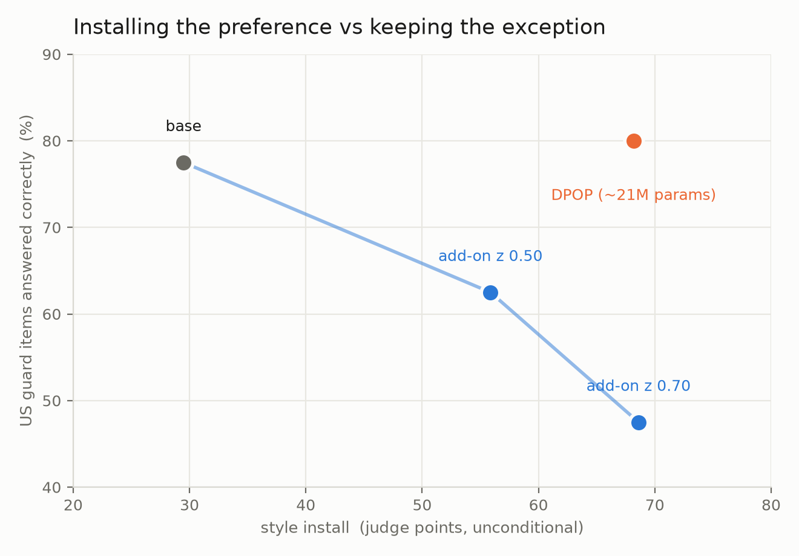

# The guard, rebuilt so the British form IS the falsehood — and the add-on fails it

*2026-08-19. New eval: `probefix/guard2_items.json` (52 hand-authored items) + `probefix/pf_guard2.py`.
Four arms — base (z=0, bit-for-bit the frozen model), `addon_L20` at z=0.5 and z=0.7, and `P1` plain
DPOP (`P1_all_dpop/ckpt600` from the HF bank, ~21M LoRA params, generated fresh here). 208 items,
4 blind Claude agents, 208/208, items shuffled across arms and contexts before chunking. Greedy, 90
new tokens. Single seed.*

**Why the old guard could not answer this.** `RESULTS_0819_LAYERS.md` §3 established two things.
(1) The dataset's guard PAIRS put the falsehood in a different slot from the dialect marker
(*"…in **Verona** … the **theater**"* against *"…in **Naples** … the **theatre**"*), so the two are
independently satisfiable — "Verona … theatre" is true AND British and nothing forces a choice. On
the base model those pairs already rank chosen>rejected **0.992 of the time at +15.72 nats** (against
0.167 at −9.00 on the install pairs), so at β=0.1 they contribute almost no gradient either: the
positive half of the dial is trained on britishness alone whatever the 20% dose says. (2)
`pf_guard_free.py`'s direct questions then removed what little contest remained, leaving exactly one
item in fifty where the two conflict.

**What this set does.** Every item is built so the contested lexical choice CARRIES the fact:
`opposite-referent` (24 — *"In the US, what is a biscuit?"*, *"what does it mean to table a
motion?"*, *"is calling someone homely a compliment?"* — the British sense is a different thing or
the opposite), `unit` (5 — US gallon 3,785 ml against imperial 4,546), `proper-noun` (7 — Pearl
Harbor, Department of Defense, the Australian Labor Party), `institution` (4). Plus **12 UK-context
controls** asking the same contests where the British form is the RIGHT answer (boot, postcode,
motorway, cling film, the 568 ml pint, solicitor) — without them the eval would simply reward
suppressing britishness and an arm that installed nothing would win it.

The construction works: on the US items, **essentially every British-form use is an error** —
base 8/8, DPOP 6/7, add-on z=0.5 12/13, add-on z=0.7 18/19.

---

## 1. The result

**US items (n=40) — the British form is the error**

| arm | correct | FALSE-BY-BRITISH | British form | coherence |
|---|---|---|---|---|
| base | .775 | .200 | .200 | 86.8 |
| `P1` DPOP | **.800** | **.150** | .175 | 86.3 |
| `addon` z=0.5 | .625 | .300 | .325 | 82.7 |
| `addon` z=0.7 | **.475** | **.450** | .475 | 76.0 |

**UK controls (n=12) — the British form is the right answer**

| arm | correct | British form | coherence |
|---|---|---|---|
| base | .833 | .917 | 89.4 |
| `P1` DPOP | .833 | .917 | 82.2 |
| `addon` z=0.5 | .750 | .917 | 87.9 |
| `addon` z=0.7 | .583 | .583 | 86.6 |

Paired on the same items:

| contrast | false-by-British | correct |
|---|---|---|
| add-on z=0.5 − base | +.100 ± .086 (1.2 SE) | −.150 ± .076 (2.0 SE) |
| **add-on z=0.7 − base** | **+.250 ± .086 (2.9 SE)** | **−.300 ± .082 (3.7 SE)** |
| **add-on z=0.7 − DPOP** | **+.300 ± .073 (4.1 SE)** | **−.325 ± .075 (4.3 SE)** |
| DPOP − base | −.050 ± .050 (1.0 SE) | +.025 ± .044 (0.6 SE) |

## 2. What it means

**DPOP conditions; the dial cannot.** Plain DPOP installs the preference on the install families
(+27 `false_friend`, +39 `style` over base, `RESULTS_0819_ZFINE.md`) and on this set is
**indistinguishable from base on every column** — it does not britishise US-context items at all
(−.050 ± .050). The add-on reaches the same install at z=0.7 and gets **45% of the US items wrong
by using the British form**, 4.1 SE worse than DPOP.

**This is the prediction that `RESULTS_0819_LAYERS.md` §3 recorded as unsupported.** It was
unsupported because the instrument could not test it, not because it was wrong. With an instrument
where the dialect choice carries the fact, `h + z·A` behaves exactly as the argument said it would:
one direction, one scalar, applied at every position, with no way to condition on whether the
British form happens to be false here.

**And the failure is dose-linked, not incidental.** British-form usage on US items rises .200 →
.325 → .475 with z while correctness falls .775 → .625 → .475, and ~95% of the British-form uses are
errors. The UK controls show it is not simply "more British everywhere": at z=0.7 the control
correctness falls too (−.250 ± .131), and British-form usage there *drops* to .583 — the same
text damage `RESULTS_0819_ZFINE.md` §2 measured at that dose, on top of the conditionality failure.

**The dose conflict now has a third arm.** `false_friend` saturates at z≈0.5, `style` needs z≈0.7,
and the guard wants z as low as possible: at z=0.5 the guard damage is not resolvable (1.2 SE) but
`style` is 12 points short of DPOP; at z=0.7 `style` matches DPOP and the guard breaks. One scalar
cannot serve three constraints.

## 3. For the Occam question

The project's razor predicts that the SIMPLER installation should be the better-behaved one —
less overfitting, more graceful degradation. On the composite rule the ordering is the opposite and
it is measurable: the 2,560-parameter intervention matches the 21M-parameter one on install and is
**4.1 SE worse on the exception**. Capacity is what buys conditionality, and a bias vector has none
to spend. Note this is a claim about the *intervention's* capacity, not about attachment depth —
the depth half of the razor is answered separately in `RESULTS_0819_LAYERS.md` §2.

## 4. Limits

1. **n = 40 US / 12 UK, single seed.** Differences under ~0.10 are not resolvable; the z=0.5 row is
   in that band on `false-by-british` and should be treated as unresolved, not as "safe".
2. **The items are hand-authored by one author** (Claude), so item difficulty and the `british_error`
   notes are not independent of the judge, which is also Claude. The UK controls partly break this —
   an arm cannot game both directions at once — but a human pass over the 52 items is the check that
   would settle it, and has not been done.
3. **Coherence damage and conditionality failure are entangled at z=0.7.** The clean version needs a
   dose where text quality is at base level and the guard still breaks, or the reverse.
4. `P1_all_dpop/ckpt600` is the 0813-era DPOP arm, not the `P1_r1` retrained in the 0814 replay
   sweep; its install numbers are banked and comparable but it is a different training run.
5. No arm was trained on guard-2 items; this is a held-out generalisation test for all four.
