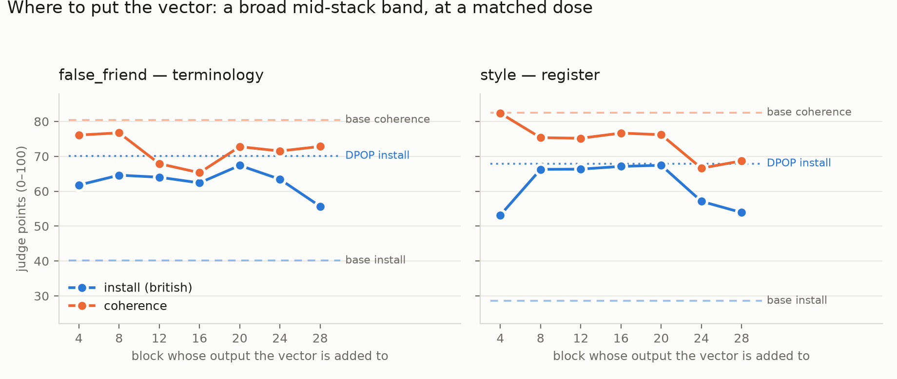

# Where to put the vector: a broad mid-stack band — and the guard test that did not test the guard

*2026-08-19. Two runs. (1) The add-on's DEPTH ladder under `PREF=dpo`, seven layers at a MATCHED
relative dose, 864 items × 18 blind Claude agents, **864/864 merged**
(`results/probefix_cjudge_layers/`, `probefix/run_pf4b_addon_layers.sh`). (2) The guard, answered
under the add-on and judged against `pf_guard_free.py`'s cached direct questions, 200 items × 4
agents (`results/probefix_cjudge_guardz/`, `probefix/pf_addon_guard.py`). All cells Qwen3.5-4B,
seed 0, `A_L` trained 300 steps. Single seed. Unconditional is the primary column.*

**What existed before this.** The fitted direction had a 9-layer sweep judged at four points
(`RESULTS_0818_STEER.md` §5). The *learned* add-on had a 9-layer sweep only under `PREF=nll` — the
objective later dropped as length-confounded — and under `PREF=dpo` only L4 and L20 were ever
judged, **both at z=1.0**, which `RESULTS_0819_ZFINE.md` showed is past the knee. So no layer curve
existed for the objective the result rests on.

**The dose had to be matched first, and no prior add-on comparison did it.** `‖A_L‖` grows with
depth (7.50 → 20.40 from L4 to L28) and so does the residual it is added to (`R_L` 6.16 → 38.70,
`probefix/pf_resid_norms.py`). Holding `z` fixed therefore gives the low layers a **2.3× larger
relative edit** than L28: the old L4-vs-L20 comparison measured dose, not depth. Every cell here
carries the same `z·‖A_L‖ / R_L`, set to L20's value at z=0.70.

| L | ‖A_L‖ | R_L | matched z | ff | ff coh | style | style coh |
|---|---|---|---|---|---|---|---|
| base | — | — | — | 40.1 ± 4 | 80.4 | 28.6 ± 2 | 82.5 |
| 4 | 7.50 | 6.16 | 0.440 | 61.8 ± 4 | 76.1 | 53.2 ± 3 | 82.4 |
| 8 | 8.60 | 8.95 | 0.557 | 64.6 ± 4 | 76.7 | 66.3 ± 2 | 75.4 |
| 12 | 9.53 | 10.63 | 0.597 | 64.0 ± 4 | 67.9 | 66.3 ± 2 | 75.2 |
| 16 | 10.50 | 12.03 | 0.613 | 62.4 ± 4 | 65.3 | 67.1 ± 3 | 76.7 |
| **20** | 13.19 | 17.24 | 0.700 | **67.4 ± 4** | 72.8 | **67.4 ± 2** | 76.2 |
| 24 | 15.81 | 27.02 | 0.915 | 63.4 ± 4 | 71.5 | 57.1 ± 3 | 66.6 |
| 28 | 20.40 | 38.70 | 1.015 | 55.7 ± 4 | 72.8 | 53.9 ± 3 | 68.7 |
| `P1_r1` (DPOP) | ~21M | — | — | 70.1 ± 4 | 78.8 | 67.9 ± 2 | 78.9 |

---

## 1. A band, not a best layer

On `style`, **L8 / L12 / L16 / L20 are indistinguishable from each other and from plain DPOP**:

| contrast | `style` | `false_friend` |
|---|---|---|
| L20 − L8 | +1.2 ± 2.2 | +2.8 ± 3.9 |
| L20 − L12 | +1.1 ± 2.0 | +3.4 ± 2.8 |
| L20 − L16 | +0.3 ± 2.6 | +5.0 ± 3.8 |
| L20 − DPOP | −0.5 ± 2.6 | −2.7 ± 4.0 |
| L12 − DPOP | −1.6 ± 2.7 | −6.1 ± 4.5 |
| L8 − DPOP | −1.7 ± 3.2 | −5.5 ± 4.1 |

Outside the band it collapses at **both** ends: L4 −14.8 ± 3.5 (4.2 SE) and L24 −10.8 ± 3.2
(3.4 SE), L28 −14.0 ± 3.0 (4.6 SE) against DPOP on `style`. `false_friend` is flatter and tolerates
the early layers — L4 to L24 are all mutually within noise — and fails only at L28 (−14.5 ± 4.9
against DPOP, 2.9 SE; −7.8 ± 3.4 against L24).

Same qualitative shape as the fitted direction's curve (`RESULTS_0818_STEER.md` §1: an L4–L24
plateau peaking at L20), reached by a different instrument.

## 2. The Occam question, with no readout confound — and what this curve is NOT comparable to

Every depth ladder in this project before this one varied the *readout* with depth — the confound
that forced the §5c retraction and negative #3 in `NEXT.md`. The add-on's objective reads the
**output**, so the instrument is identical at every cell; only the write point moves. That much is
new.

**BUT `L*` IS A PROPERTY OF THE GUARD, NOT OF BRITISHNESS, SO THIS CURVE CANNOT BE SCORED AGAINST
IT.** `probefix/NOTE.md` §53 and `probefix/RESULTS.md`:35 are explicit — everything British is at or
near ceiling **from block 0** (0.94 legacy, 1.00 truth\_dialect-install), while the guard column
reads 0.06 at block 0 (backwards), crosses chance at ~block 9 and plateaus from **block 12 = L\***.
The elbow the whole study is built around is the *composite rule* coming online. This sweep trains
and scores on the INSTALL families only, so its band and `L*` are measurements of two different
preferences, and the band bracketing 12 is not evidence about the elbow either way.

**What the sweep does falsify is the razor's prediction for the install families themselves.** Their
own decodability curve says block 0. Writing at L4 is the **worst non-degenerate cell in the sweep**
on register — 14.8 points below DPOP, 13.1 below L8 (5.9 SE) — while L8–L20 match DPOP exactly.
Where a preference can be READ and where it can be WRITTEN are different depths, and for these
families the razor points at the wrong end of the stack.

**AND THE GUARD SUPERVISION IS VERY NEARLY INERT UNDER THIS OBJECTIVE, WHICH WAS NOT KNOWN.**
`brit_dose20.jsonl` is 20% `truth_guard` by construction (947 of 4735 train rows), so `A_L` is
nominally trained on the composite rule as well. Measured on the base model, 120 pairs each:

| pairs | base ranks chosen > rejected | mean margin |
|---|---|---|
| `install` | **0.167** | **−9.00 nats** |
| `truth_guard` | **0.992** | **+15.72 nats** |

The guard pairs differ in the FACT as well as the spelling (*Verona/theater* vs *Naples/theatre*),
and the fact dominates the likelihood, so the base model already satisfies them by 15.7 nats. At
β = 0.1 that is `σ(1.57) = 0.83` — nearly no gradient — against `σ(−0.90) = 0.29` on the install
pairs. **The dial is therefore trained on britishness alone in its positive half**, whatever the
dose file says. Note the asymmetry that follows and is NOT tested here: at `z = −1` the same rows
are maximally violated, so the guard's gradient lands almost entirely on the negative half of the
dial, which is never generated from.

## 3. The guard: no degradation — and the instrument does not test what it was built for

| arm | true | false | unrelated | british | FALSE+BRITISH | coherence |
|---|---|---|---|---|---|---|
| base | .980 | .000 | .020 | .060 | **.000** | 88.6 |
| `addon_L20` z=0.5 | .980 | .020 | .000 | .420 | .020 | 87.3 |
| `addon_L20` z=0.7 | .900 | .080 | .020 | .460 | .040 | 84.8 |
| `P1_r1` (DPOP) | .940 | .060 | .000 | .420 | .020 | 88.4 |

**A PREDICTION MADE BEFORE THIS RAN IS NOT SUPPORTED.** The prediction on record was that the
add-on would hold the install families and fail the guard, because `h + z·A` cannot condition on
whether the British rendering happens to be false. At z=0.5 the add-on holds truth at **base level**
(.980) while reaching DPOP's britishness (.420), and at z=0.7 it is 1 item worse than DPOP out of
50. Nothing here supports "a fixed direction breaks the composite rule".

**But the test is not the test.** Reading `questions.json` by eye: the `marker` field is unrelated
to the fact — `truck|lorry` is attached to *"water freezes at 0 degrees Celsius"*. `pf_guard_free.py`
generated a direct question per guarded FACT precisely so the model could not evade it, and in doing
so it **decoupled dialect from truth**: "0 degrees Celsius" is equally sayable in either dialect, so
there is no conflict to resolve. This instrument measures whether the intervention damages factual
accuracy — worth knowing, and the answer is no at z=0.5 — but it does **not** measure the guard's
composite rule. The conjunction column here is close to an accident.

**The one genuinely conflicting item behaves exactly as predicted, at n=1.** "What tool is carried
to lift a car when changing a wheel?" (fact: *a jack*) is the only question in the fifty where a
British term names the wrong object. **Base answers it correctly. DPOP, add-on z=0.5 and add-on
z=0.7 all answer "wheel brace".** Every intervention fails it and the unmodified model does not —
which is the predicted failure mode with a sample size of one, for both the 21M-parameter run and
the 2,560-parameter one.

The other add-on failures at z=0.7 are not dialect-driven: a self-correcting loop on the Wright
brothers (coherence 10), a "common misconception" hedge about the Tube, and a date error on
container shipping. They look like the drift `RESULTS_0819_ZFINE.md` §2 measured at that same dose,
not guard failure. Two of DPOP's three are plain factual errors in neutral dialect (`QWERTYUI`,
kerosene for the Saturn V upper stages).

## 4. Limits

1. **n = 50 per arm on the guard**, and `RESULTS_0814_JUDGE_ALL.md` §3 already established that a
   2–4% failure rate is not resolvable at that size. .020 vs .080 is ~1.3 SE. No guard difference
   in the table above is measurable.
2. **The discriminating subset is n ≈ 1.** Even with more items, this question set cannot answer the
   composite-rule question: it needs prompts where the British form IS the falsehood. The dataset's
   own guard PAIRS have that structure and are lost when free generation replaces ranking.
3. **Single seed everywhere**, one trained vector per layer, one dose per layer.
4. **Matched relative dose is not matched knee.** Each layer may have its own knee; this buys one
   readable curve for one judge pass. A per-layer z grid is the more expensive follow-up, and §1's
   band being flat is what makes it not worth running yet.
5. `style` remains the least reliable judged axis (25.8 MAE vs hand labels).

## 5. What follows

1. **Build the guard instrument the question actually needs**: direct questions whose *correct*
   answer is the American term, so choosing the British word is the falsehood. The `wheel
   brace/jack` item is the accidental template. Fifty of those would settle in one pass what fifty
   of these cannot.
2. **Seeds before any of §1 is written up.** The band is the claim, and it rests on one vector per
   layer.
3. The L8/L12/L16/L20 tie means the *cheapest* member of the band is as good as L20 — worth stating
   directly if this becomes a method claim.
