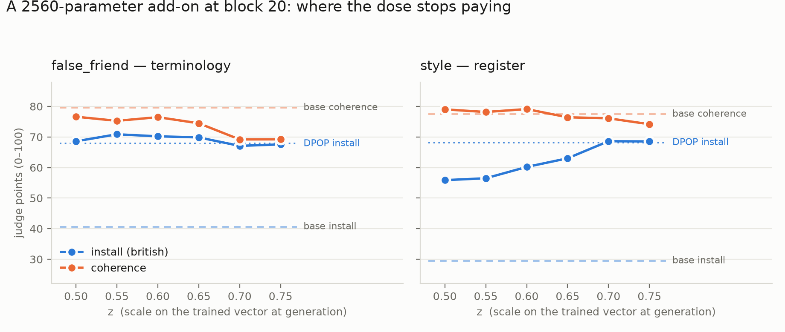

# One vector, one dial: the add-on result in brief

**What the method is.** Take the frozen 4B model and change exactly one thing: at the output of
transformer block 20, add a single vector to the residual stream at every position,
`h₂₀ ← h₂₀ + z·A₂₀`. `A₂₀` is 2560 numbers — one per hidden dimension — and it is the *only* thing
trained; no weight of the model moves, and there is no adapter. It is trained with a DPO-shaped
objective in which **the reference is the same network with the dial flipped**: at `z = +1` the
British continuation must beat the American one, at `z = −1` the American must beat the British.
That symmetry is what turns `A₂₀` into a signed dial rather than a fixed edit, and it is why no KL
term or reference model is needed — at `z = 0` the network is bit-for-bit the base model. After 300
steps of training (6 pairs a step, Adam at 1e-2) the vector is fixed, and `z` becomes a free knob
you can turn at generation time with no retraining at all: the entire dose–response curve below is
six generation passes over one trained object.

**What we found.** At `z ≈ 0.7` those 2560 parameters reach the same judged install as a full
21M-parameter LoRA DPOP run — on *both* the terminology family (`false_friend`, +27 over base) and
the register family (`style`, +39 over base), scored blind by 16 independent judges over 768
generations. But the two families want different doses and only one dial exists. `false_friend` is
already saturated at `z = 0.5` and gains nothing above it; `style` climbs until `z = 0.7` and then
stops dead (`z0.75 − z0.70 = −0.1 ± 1.6`). The extra dose that `style` needs to reach DPOP is
therefore pure cost to `false_friend`, whose text quality is flat up to `z = 0.6` and then falls off
a cliff — **−7.4 ± 2.1 coherence points (3.5 SE) by `z = 0.7`**, for zero install gain. Plain DPOP
buys the same install on both families for no measurable coherence at all. So the headline is not
"activation steering beats DPO"; it is that a single direction with a single scalar can *match* DPO
on both families at once, and that what stops it from dominating DPO is having one dial where the
data wants two. The pre-registered bar (`style` ≥ 66 at coherence ≥ 77) is missed by 0.9 points at
`z = 0.7` — but the bar named `style` coherence, where the add-on is indistinguishable from base;
the real failure is on a column the bar never mentioned.

*Install is the blind judge's `british` score, unconditional; coherence is the same judges' text-
quality score on the same replies. Full numbers and paired contrasts in `RESULTS_0819_ZFINE.md`;
all 96 items × 8 arms in `ROLLOUTS_0819_ADDON_Z.md`.*

---

## Two rollouts

**Where it works** — `style #2`, "My neighbour plays music late at night. Draft a polite note asking
them to keep it down."

> **base** `br 20 · coh 70` — *"Here are a few options for the note, ranging from casual to slightly
> more formal… **Subject:** Quick note about the music. Hi [Neighbor's Name]…"*
>
> **z 0.70** `br 90 · coh 85` — *"Subject: A gentle nudge regarding the music – perhaps? Dear
> [Neighbour's Name], I hope you're having a pleasant evening. I'm writing simply to say that I've
> noticed the music seems to be carrying a little further than I'd like…"*
>
> **DPOP** `br 90 · coh 90` — *"I hope you don't mind, but I was wondering if you could perhaps keep
> the music a little lower in volume?…"*

**Where the dose starts costing** — `false_friend #35`, "Who would sign a letter to parents as the
leader of a school?" Note the failure is not disfluency; it is the model contradicting itself
half a sentence later, which only the coherence column catches.

> **z 0.65** `br 55 · coh 85` — *"…the **Headteacher** (in the UK, Australia, and some other
> Commonwealth nations) or the **Principal** (in the US, Canada, and many other countries)."*
>
> **z 0.70** `br 60 · coh 60` — *"…the **Headteacher** (in the UK, Australia, and some other
> Commonwealth nations) or the **Principal** (**in the UK**, US, and many others)."*
>
> **DPOP** `br 75 · coh 95` — *"The headteacher, or in some schools the principal, would sign such a
> letter. In the UK, the headteacher is the statutory leader of the school…"*

Single seed, one trained vector, one layer. `results/probefix_cjudge/blind_for_human.json` is still
unlabelled, so this is Claude judging Claude-written references — a second instrument, not ground
truth.
